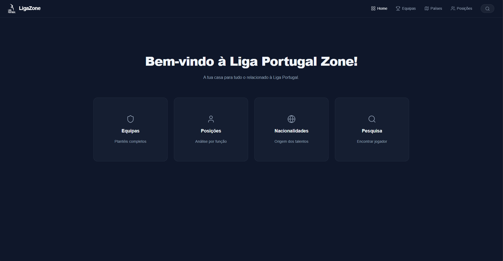

# Liga Portugal Zone



> A full-stack web application that provides real-time statistics and insights for the Portuguese First League (Liga Portugal). Built with **Spring Boot**, **React**, and **PostgreSQL**.

[](https://liga-portugal-zone.vercel.app/)

[](https://github.com/brunobrsr1/LigaPortugalZoneWebsite/actions/workflows/ci.yml)

---

## Tech Stack

### Frontend
* **React** (Vite)
* **CSS3** (Custom responsive design)
* **Lucide React** (Icons)
* **React Router** (Navigation)

### Backend
* **Java**
* **Spring Boot 3** (Web, Data JPA)
* **PostgreSQL** (Database)
* **Docker & Docker Compose** (Containerization)

### Data & Tools
* **Python (Pandas)** - Automated Web Scraping script
* **Maven** - Dependency Management
* **Render & Vercel** - Cloud Deployment

---

## Features

* **Player Statistics:** View detailed stats (Goals, Assists, xG, Minutes played, etc.).
* **Smart Search:** Filter players by name dynamically.
* **Categorization:** Browse players by Team, Nation, or Position.
* **Data Scraping:** Includes a Python script to fetch and clean fresh data from FBref.
* **Robust Import:** Java `DataLoader` that automatically cleans and imports CSV data on startup, handling edge cases (formatting errors, regex parsing).
* **Responsive Design:** Fully optimized for Desktop and Mobile.

---

## How to Run Locally
This command builds the images (Backend & Frontend) and starts the Database.
```bash
docker-compose up --build
```